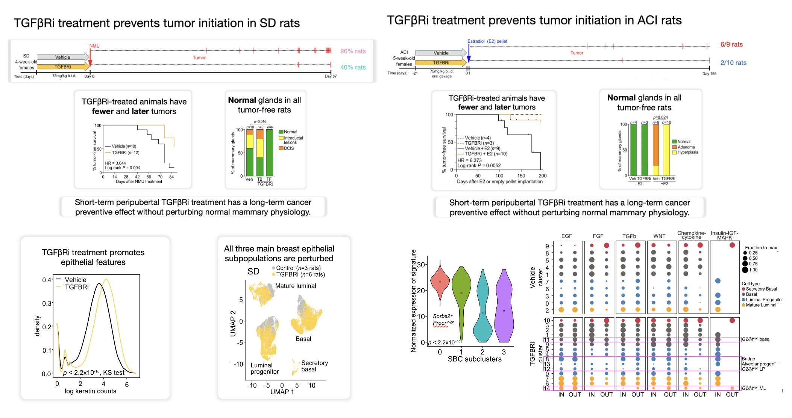

Breast cancer prevention by short-term inhibition of TGFB signaling
--------

This repository contains code, data, tables and plots to support genomic analyses and reproduce results from the paper [Breast cancer prevention by short-term inhibition of TGFB signaling](https://www.nature.com/articles/s41467-022-35043-5), published in Nature Communications in December 2022.

Abstract
--------
Cancer prevention has a profound impact on cancer-associated mortality and morbidity. We previously identified TGFB signaling as a candidate regulator of mammary epithelial cells associated with breast cancer risk. In this paper, we show that short-term TGFBR inhibitor (TGFBRi) treatment of peripubertal ACI inbred and Sprague Dawley outbred rats induces lasting changes and prevents estrogen- and carcinogen-induced mammary tumors, respectively. We identify TGFBRi-responsive cell populations by single cell RNA-sequencing, including a unique epithelial subpopulation designated secretory basal cells (SBCs) with progenitor features. We detect SBCs in normal human breast tissues and find them to be associated with breast cancer risk. Interactome analysis identifies SBCs as the most interactive cell population and the main source of insulin-IGF signaling. Accordingly, inhibition of TGFBR and IGF1R decrease proliferation of organoid cultures. Our results reveal a critical role for TGFB in regulating mammary epithelial cells relevant to breast cancer and serve as a proof-of-principle cancer prevention strategy.

 

Content
-------
* `/01_cellranger/`: cellranger quality control html files on samples from the three single cell datasets generated: sorted ACI epithelial cells, sorted SD epithelial cells, whole mammary gland SD cells. 
* `/02_R_single_cell/`: R scripts to reproduce single cell analyses.
* `/03_R_bulk/`: R scripts to reproduce bulk RNASeq analyses.
* `/data/`: preprocessed bulk outputs, cellranger count outputs and htseq count outputs
* `/plots/`: output plots from the single cell and bulk analyses, organized by self-explanatory folder names.
* `/tables/`: number of cells per cluster, relevant gene lists (e.g. signatures) used throughout the analysis, differentially expressed genes from bulk analyses, and multiple sample metadata files.

Data
-------
The RNA-seq and scRNA-seq data generated in this study have been deposited in the NCBI GEO database under accession number [GSE184095](https://0-www-ncbi-nlm-nih-gov.brum.beds.ac.uk/geo/query/acc.cgi?acc=GSE184095).

Preprocessed RDS objects can be downloaded from [zenodo](https://zenodo.org/record/7293642#.Y4krEi-B19f).

HTSeq counts inputs from the bulk RNASeq analysis can be downloaded from `/data/`.

## Tweetorial
[Twitter thread](https://twitter.com/simocristea/status/1600578512578035733?s=20&t=6BMj6FQPDUlc2CtfIFQmLw) presenting the main findings of the paper.

## Contact
For any questions, comments or suggestions regarding the code or the manuscript, please feel to reach out to me via GitHub, Twitter or email (scristea@jimmy.harvard.edu).